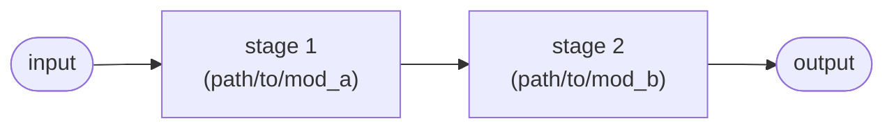
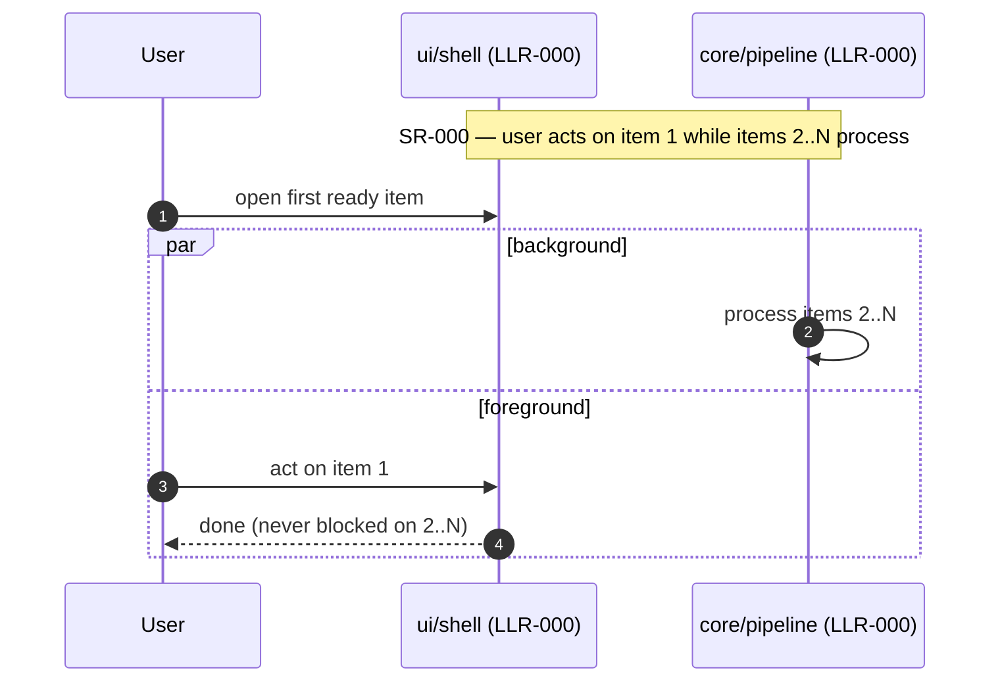

# Architecture (one page)

Owned by the **Software Engineer** hat. The **overview** below is hand-written
and must stay within one screen; the **module/function map** and the
**dependency diagram** are **generated** by the check harness so they cannot
drift (see [process.md §3/§7](process.md)).

## High-level flow

Hand-written and small. Diagrams are Mermaid fenced blocks — rendered natively
by GitHub/GitLab and the VS Code Markdown preview, no toolchain needed (see
process.md "Diagrams are text"). Replace this example with your data flow:

_Describe the data flow in a few nodes. Keep it readable at a glance._

## Runtime flows (authored at G2)

Hand-written **with the LLRs, before the G2 review** — these diagrams are how a
human verifies *behavior* (ordering, concurrency, what blocks on what) without
reverse-engineering it from registry rows. Required from G2 on and checked by
`python scripts/check_flows.py` (wired into the harness): the section must
exist, hold at least one Mermaid diagram, and every cited `SR-`/`LLR-` id must
exist in the registries (so the flows stay traceable as requirements evolve).

Author one sequence diagram per key user-visible scenario, and **always one for
anything concurrent / asynchronous / non-blocking** — that's where reviewers
misread CSVs. Participants are planned modules (the LLR `Module` column); cite
the ids a diagram renders in its title or `Note`s. Replace this example:

_Update a flow in the same change that alters its LLRs — a stale flow diagram
is a design lie. Sequence diagrams for simpler, synchronous interactions are
welcome here too._

### Program flow (generated)

The ordered steps of the entry/orchestrator function, generated from the code by
`python scripts/gen_arch_map.py --flow <entry>` (wire `--flow` into the harness's
map step). Keep the orchestrator thin so this reads as the high-level flow; the
diagram above carries the control flow this list omits.

<!-- BEGIN GENERATED FLOW -->
_(run `gen_arch_map.py --flow <entry>` to populate — e.g. `--flow run`)_
<!-- END GENERATED FLOW -->

## Module responsibilities

| Module | Responsibility | Key public items |
|---|---|---|
| `path/to/mod_a` | <one line> | |
| `path/to/mod_b` | <one line> | |

Design rules (reviewed): shared logic lives in one place (no duplication); pure,
unit-testable cores are separated from I/O / network / GUI shells; functions stay
small; each module has a single clear responsibility. The generated map and
dependency diagram below make violations (duplication, a forbidden import edge)
*visible* at a glance, but enforcing these rules is the reviewer's job, not the
harness's — don't read "reviewed" as "machine-checked".

## Module dependencies (generated)

The internal-import graph, harvested from the AST — each arrow is an import, so
a layering violation (e.g. an arrow from `common` into `engine`) is visible at
a glance.

<!-- BEGIN GENERATED DEPENDENCY DIAGRAM -->
_Generated by `scripts/gen_arch_map.py` from the source tree (AST): each arrow is an internal import. Do not edit by hand; run the check harness to refresh._

_(no source scanned)_
<!-- END GENERATED DEPENDENCY DIAGRAM -->

<!-- BEGIN GENERATED MODULE MAP -->
_Generated by `scripts/gen_arch_map.py` from the source tree (AST). Do not edit by hand; run the check harness to refresh. Summaries and `Implements:` come from your docstrings/comments._

_(no source scanned)_
<!-- END GENERATED MODULE MAP -->
