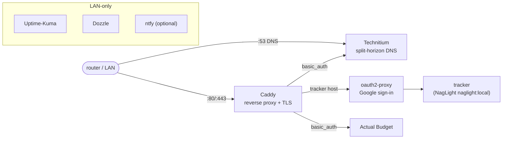

# Architecture (one page)

Owned by the **Software Engineer** hat. This is a **config/infra repo** — there
is no compiled product source, so the kit's *generated* code-map / dependency
diagram do not apply and the `arch-map` check is dropped (see
[status.md](status.md) constraints; ADOPTING.md §3). The overview below is the
hand-written source of truth for the deploy topology.

Related requirements: [stakeholder-needs.md](requirements/stakeholder-needs.md)
(SN-###) → [system-requirements.csv](requirements/system-requirements.csv)
(SR-###).

## What this repo produces

An **unattended deploy image** for the headless AWOW AK41 box: an Ubuntu
autoinstall (`stack/autoinstall/`) that installs the OS + Docker, drops the
stack, and enables a one-shot first-boot unit that brings everything up and
provisions DNS — zero clicks (SR-001).

## Topology

- **Ingress:** the router forwards :80/:443 to Caddy, which terminates TLS
  (public cert, valid on-LAN via split-horizon) and routes per host.
- **Auth split (D1/D2):** the tracker host goes through **oauth2-proxy** (Google
  sign-in, allow-list) with **no** basic_auth; Actual and the DNS console keep
  **basic_auth**. The tracker container is bridge-only (`expose`, never
  host-published) so its only ingress is the proxy (SR-004).
- **DNS:** Technitium owns :53 on the host network and serves split-horizon
  records; `provision/provision-technitium.sh` configures it idempotently over
  its HTTP API.
- **Image ownership:** the tracker image (`naglight:local`) is built by the
  **NagLight** repo (D1/WI-10.4); this repo consumes it. The migrated
  `stack/tracker/*.deprecated` files are reference-only.
- **Observability (WI-10.11):** Uptime-Kuma, Dozzle, and optional ntfy run
  LAN-only.
- **Remote management (WI-10.12):** SSH (key-only), Cockpit, and
  unattended-upgrades are provisioned by the autoinstall;
  `REMOTE_MANAGEMENT.md` is the ops + reimage-ladder memo.

## Layout

| Path | Responsibility |
|---|---|
| `stack/docker-compose.yml` | service definitions, health-checks, restart policy |
| `stack/caddy/Caddyfile` | reverse-proxy routing + auth model |
| `stack/autoinstall/` | Ubuntu autoinstall + first-boot bring-up |
| `stack/provision/` | idempotent Technitium provisioning + headless health check |
| `stack/tracker/` | deprecated reference copies (NagLight owns the build) |
| `scripts/validate_config.py` | config-coverage validation (the product-layer check here) |
| `docs/` | the requirement spine, status ledger, and this overview |

## Validation model

No Docker on the dev machine (verified), so **runtime bring-up is not exercised
here**. `scripts/validate_config.py` asserts config *coverage* (every compose
`${VAR}` has an `.env.example` key; every Caddy `{$VAR}` is passed by the caddy
service; referenced files exist; YAML parses). Runtime validation is PENDING the
first Docker host — tracked honestly in [status.md](status.md).
