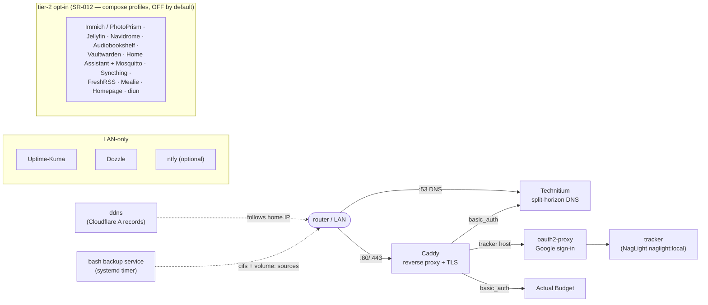

# Architecture (one page)

Owned by the **Software Engineer** hat. This is a **config/infra repo** — there
is no compiled product source, so the kit's *generated* code-map / dependency
diagram do not apply and the `arch-map` check is dropped (see
[status.md](status.md) constraints; ADOPTING.md §3). The overview below is the
hand-written source of truth for the deploy topology.

Related requirements: [stakeholder-needs.md](requirements/stakeholder-needs.md)
(SN-###) → [system-requirements.csv](requirements/system-requirements.csv)
(SR-###).

## What this repo produces

An **unattended deploy image** for the headless AWOW AK41 box: an Ubuntu
autoinstall (`stack/autoinstall/`) that installs the OS + Docker, drops the
stack, and enables a one-shot first-boot unit that brings everything up and
provisions DNS — zero clicks (SR-001).

## Topology

- **Ingress:** the router forwards :80/:443 to Caddy, which terminates TLS
  (public cert, valid on-LAN via split-horizon) and routes per host.
- **Auth split (D1/D2):** the tracker host goes through **oauth2-proxy** (Google
  sign-in, allow-list) with **no** basic_auth; Actual and the DNS console keep
  **basic_auth**. The tracker container is bridge-only (`expose`, never
  host-published) so its only ingress is the proxy (SR-004).
- **DNS:** Technitium owns :53 on the host network and serves split-horizon
  records; `provision/provision-technitium.sh` configures it idempotently over
  its HTTP API.
- **Image ownership:** the tracker image (`naglight:local`) is built by the
  **NagLight** repo (D1/WI-10.4); this repo consumes it via the SR-006 resolver
  chain (`scripts/ensure-local-images.sh`: present → sibling build → declared
  public image). The migrated `stack/tracker/*.deprecated` files are
  reference-only. Cross-repo contracts: `docs/requirements/interfaces.csv`.
- **DDNS (WI-9 Q4):** the `ddns` container keeps the apex + wildcard Cloudflare
  A records pointed at the home IP, so the whole external path survives an IP
  change.
- **Observability (WI-10.11):** Uptime-Kuma, Dozzle, and optional ntfy run
  LAN-only.
- **Backup (WI-10.10/SR-013):** the bash backup service (systemd timer, not a
  container) pulls one `BACKUP_SOURCES` table — LAN cifs shares AND the stack's
  own docker volumes (`volume:VOL[@container]` quiesce) — through
  archive/hash/manifest/retention/offsite/report; never-silent-green into the
  tracker's `/api/feed`.
- **Tier-2 opt-in catalog (SN-009/SR-012):** additional self-hosted services
  behind compose profiles — OFF by default, LAN_IP-bound or Caddy-site-only,
  excluded from the baked ISO payload unless exported with `EXTRA_PROFILES`.
  `COMPOSE_PROFILES` in `.env` is the enable switch; see stack/README §9.
- **Remote management (WI-10.12):** SSH (key-only), Cockpit, and
  unattended-upgrades are provisioned by the autoinstall;
  `REMOTE_MANAGEMENT.md` is the ops + reimage-ladder memo.

## Layout

| Path | Responsibility |
|---|---|
| `stack/docker-compose.yml` | service definitions (core + profile-gated tier-2), health-checks, restart policy |
| `stack/caddy/Caddyfile` | reverse-proxy routing + auth model (+ commented tier-2 sites) |
| `stack/autoinstall/` | Ubuntu autoinstall + first-boot bring-up |
| `stack/provision/` | idempotent Technitium provisioning + headless health check |
| `stack/backup/` | the bash backup service (six-step pipeline, restore, drive power) |
| `stack/mosquitto/` | committed MQTT broker config (tier-2 home-automation profiles) |
| `stack/tracker/` | deprecated reference copies (NagLight owns the build) |
| `sim/` | V1 AWOW-sim — the full stack vs fictional stand-ins (Dex, Samba, mock shims) |
| `vmtest/` | V3 — the real autoinstall ISO booted in Hyper-V (SIM secrets only) |
| `scripts/validate_config.py` | config-coverage validation (the product-layer check here) |
| `scripts/ensure-local-images.sh` | SR-006 resolver for private-repo images (present → sibling → public) |
| `docs/` | the requirement spine, status ledger, and this overview |

## Validation model

Three progressively-more-real tiers (the original "no Docker on the dev box"
constraint was lifted 2026-07-03, WI-10.13):

1. **Static** — `scripts/validate_config.py` asserts config *coverage* (every
   compose `${VAR}` has an `.env.example` key; every Caddy `{$VAR}` is passed by
   the caddy service; referenced files exist; YAML parses). Runs anywhere,
   no Docker.
2. **V1 sim (GREEN)** — the full stack runs on WSL2/docker-ce against fictional
   stand-ins (`sim/`): Dex for Google, internal CA for ACME, Samba fixtures for
   Mini-serv, mock shims for hdparm/docker call contracts. Zero real secrets.
3. **V3 VM → hardware** — the real autoinstall ISO in Hyper-V (`vmtest/`, SIM
   secrets), then the real box + burn-in. What only these can prove: real
   Google consent, public ACME, host `:53`, drive spin-down physics, thermals.

The honest ledger of what has and has not been exercised is
[status.md](status.md).
