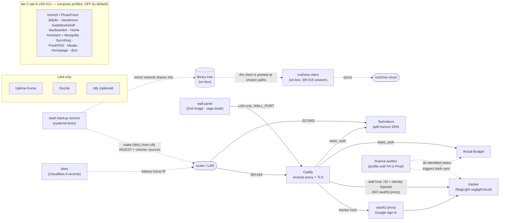

# Architecture (one page)

Owned by the **Software Engineer** hat. This is a **config/infra repo** — there
is no compiled product source, so the kit's *generated* code-map / dependency
diagram do not apply and the `arch-map` check is dropped (see
[status.md](status.md) constraints; ADOPTING.md §3). The overview below is the
hand-written source of truth for the deploy topology.

Related requirements: [stakeholder-needs.md](requirements/stakeholder-needs.md)
(SN-###) → [system-requirements.csv](requirements/system-requirements.csv)
(SR-###).

## What this repo produces

**Two images from one pipeline** (OI-12 / D-W0, ratified 2026-07-29):

1. The **AWOW AK41 always-on core** — an Ubuntu autoinstall
   (`stack/autoinstall/`) that installs the OS + Docker, drops the stack, and
   enables a one-shot first-boot unit that brings everything up and provisions
   DNS — zero clicks (SR-001).
2. The **office wall panel** — a graphical variant of the same autoinstall
   (`stack/autoinstall/wall/`) that boots into one fullscreen app under a Wayland
   kiosk compositor, with no Docker, no login, and a nightly sleep window
   (SR-017). It is a **disposable thin client**: reimage-not-repair, held to
   SN-013's lighter bar rather than SN-001's zero-click always-on guarantee.

The pipeline (ISO assembly, payload bake, secret materialisation, SSH posture) is
shared; only the target and its `user-data` differ.

## Topology

```mermaid
graph LR
    net([router / LAN]) -->|:80/:443| caddy["Caddy<br/>reverse proxy + TLS"]
    net -->|:53 DNS| tech["Technitium<br/>split-horizon DNS"]
    caddy -->|tracker host| oauth["oauth2-proxy<br/>Google sign-in"]
    oauth --> tracker["tracker<br/>(NagLight naglight:local)"]
    panel["wall panel<br/>(2nd image · cage kiosk)"] -->|"LAN only :WALL_PORT"| caddy
    caddy -->|"wall host: /32 + identity injected<br/>(NO oauth2-proxy)"| tracker
    caddy -->|basic_auth| actual["Actual Budget"]
    caddy -->|basic_auth| tech
    ddns["ddns<br/>(Cloudflare A records)"] -.->|follows home IP| net
    backup["bash backup service<br/>(systemd timer)"] -.->|"wake (WoL) then cifs INGEST + volume: sources"| net
    backup -.->|"mirror network shares into"| lib[("library tree<br/>(on-box)")]
    lib -.->|"the client is pointed at chosen paths"| ice["IceDrive client<br/>(on-box, SR-015 session)"]
    ice -.->|syncs| cloud([IceDrive cloud])
    fa["finance-auditor<br/>(profile until FA G-Final)"] -.->|triggers bank sync| actual
    fa -.->|de-identified status| tracker
    subgraph observability [LAN-only]
      kuma["Uptime-Kuma"]
      dozzle["Dozzle"]
      ntfy["ntfy (optional)"]
    end
    subgraph tier2 ["tier-2 opt-in (SR-012 — compose profiles, OFF by default)"]
      t2["Immich / PhotoPrism · Jellyfin · Navidrome · Audiobookshelf ·<br/>Vaultwarden · Home Assistant + Mosquitto · Syncthing ·<br/>FreshRSS · Mealie · Homepage · diun"]
    end
```

- **Ingress:** the router forwards :80/:443 to Caddy, which terminates TLS
  (public cert, valid on-LAN via split-horizon) and routes per host.
- **Auth split (D1/D2):** the tracker host goes through **oauth2-proxy** (Google
  sign-in, allow-list) with **no** basic_auth; Actual and the DNS console keep
  **basic_auth**. The tracker container is bridge-only (`expose`, never
  host-published) so its only ingress is a Caddy site (SR-004).
- **A THIRD auth model — the wall kiosk site (SR-016, ratified 2026-07-29):** a
  keyboard-less panel cannot complete an OAuth consent, so
  `{$WALL_HOST}:{$WALL_PORT}` **bypasses oauth2-proxy** and injects the panel's
  identity itself. This makes the tracker's trusted headers have a *second*
  injector, which is why it needed ratification. Four independent guards, all
  load-bearing: the injected `X-Forwarded-User` **replaces** any client-supplied
  one (a delete of that field would be applied *after* the set and erase it —
  see the Caddyfile banner); the source must match `{$PANEL_IP}/32`, not the LAN
  CIDR; the port is published bound to `LAN_IP` and the router forwards only
  :80/:443, so a WAN packet cannot arrive; and everything else gets `403` at the
  edge. The same site serves the shell's static build, because NagLight sends no
  CORS headers and the app's `/api/*` calls must be same-origin.
- **DNS:** Technitium owns :53 on the host network and serves split-horizon
  records; `provision/provision-technitium.sh` configures it idempotently over
  its HTTP API.
- **Image ownership:** the tracker image (`naglight:local`) is built by the
  **NagLight** repo (D1/WI-10.4); this repo consumes it via the SR-006 resolver
  chain (`scripts/ensure-local-images.sh`: present → sibling build → declared
  public image). The migrated `stack/tracker/*.deprecated` files are
  reference-only. Cross-repo contracts: `docs/requirements/interfaces.csv`.
- **DDNS (WI-9 Q4):** the `ddns` container keeps the apex + wildcard Cloudflare
  A records pointed at the home IP, so the whole external path survives an IP
  change.
- **Observability (WI-10.11):** Uptime-Kuma, Dozzle, and optional ntfy run
  LAN-only.
- **Backup (WI-10.10/SR-013):** the bash backup service (systemd timer, not a
  container) **wakes, ingests, then archives** — a source box that is allowed to
  sleep gets a Wake-on-LAN packet and must answer tcp/445 before the run touches
  it (a wake timeout fails the run loudly); each `INGEST_SOURCES` network share is
  then **mirrored into the library tree** (`rsync -a --delete`, so deletions
  propagate — ratified 2026-07-29), and one `BACKUP_SOURCES` table covers those
  library folders (`path:`), any share pulled directly, AND the stack's own docker
  volumes (`volume:VOL[@container]` quiesce) through
  archive/hash/manifest/retention/report — minus the `BACKUP_EXCLUDE` /
  `name.exclude=` patterns, which are logged, listed per run and recorded in the
  MANIFEST. There is **no offsite step in the target state** (Owner, 2026-07-29,
  correcting OI-11): the IceDrive client is pointed at chosen **library** paths in
  its own GUI and syncs them itself, so `OFFSITE_ENABLED=false` and both
  `OFFSITE_PATH`/`OFFSITE_UNC` are legacy. Never-silent-green into the tracker's
  `/api/feed`, on **every** failure path including `die` (OI-9).
- **Tier-2 opt-in catalog (SN-009/SR-012):** additional self-hosted services
  behind compose profiles — OFF by default, LAN_IP-bound or Caddy-site-only.
  `COMPOSE_PROFILES` in `.env` is the enable switch; see stack/README §9.
  **Whatever it enables is BAKED (corrected 2026-08-07).** `export-images.sh`
  reads that key from the `.env` it is bundling and resolves the image set for
  exactly those profiles, so an enabled service whose image cannot be resolved
  is a refused *build*. It used to hardcode `--profile ntfy`, which meant a box
  configured for five profiles shipped with nine images and went to the registry
  on first boot for the rest — defeating the offline install one step past the
  install itself. `EXTRA_PROFILES` still adds profiles the `.env` does not
  enable.
- **Remote management (WI-10.12):** SSH (key-only), **passwordless `sudo`**,
  Cockpit, and unattended-upgrades are provisioned by the autoinstall. The sudo
  drop-in is the third leg of the key-only design, not a separate concession —
  a locked password makes `sudo` unsatisfiable, so without it the box is
  read-only over SSH. `REMOTE_MANAGEMENT.md` is the ops + reimage-ladder memo
  and carries the full argument.

## Layout

| Path | Responsibility |
|---|---|
| `stack/docker-compose.yml` | service definitions (core + profile-gated tier-2), health-checks, restart policy |
| `stack/caddy/Caddyfile` | reverse-proxy routing + auth model (+ commented tier-2 sites) |
| `stack/autoinstall/` | Ubuntu autoinstall + first-boot bring-up (the AWOW core) |
| `stack/autoinstall/wall/` | image target 2 — the wall panel: graphical variant, hardware-quirk fixes, sleep window, burn-in checklist |
| `stack/wall-shell/` | payload dir the kiosk site serves as its document root (the OfficeWallNaglight build; IF-005) |
| `stack/provision/` | idempotent Technitium provisioning + headless health check |
| `stack/backup/` | the bash backup service (six-step pipeline, restore, drive power) |
| `stack/mosquitto/` | committed MQTT broker config (tier-2 home-automation profiles) |
| `stack/remote-ui/` | OPT-IN light RDP layer for GUI-only vendor apps (SR-015). **Nothing installs or calls it since 2026-08-27** — its only tenant moved to `stack/icedrive/` |
| `stack/icedrive/` | the headless IceDrive CLI: pinned binary, one-time non-interactive sign-in, FUSE mount unit |
| `stack/tracker/` | deprecated reference copies (NagLight owns the build) |
| `sim/` | V1 homehub-sim — the full stack vs fictional stand-ins (Dex, Samba, mock shims) |
| `vmtest/` | V3 — the real autoinstall ISO booted in Hyper-V (SIM secrets only) |
| `scripts/validate_config.py` | config-coverage validation (the product-layer check here) |
| `scripts/ensure-local-images.sh` | SR-006 resolver for private-repo images (present → sibling → public) |
| `docs/` | the requirement spine, status ledger, and this overview |

## Validation model

Three progressively-more-real tiers (the original "no Docker on the dev box"
constraint was lifted 2026-07-03, WI-10.13):

1. **Static** — `scripts/validate_config.py` asserts config *coverage* (every
   compose `${VAR}` has an `.env.example` key; every Caddy `{$VAR}` is passed by
   the caddy service; referenced files exist; YAML parses). Runs anywhere,
   no Docker.
2. **V1 sim (GREEN)** — the full stack runs on WSL2/docker-ce against fictional
   stand-ins (`sim/`): Dex for Google, internal CA for ACME, Samba fixtures for
   Mini-serv, mock shims for hdparm/docker call contracts. Zero real secrets.
3. **V3 VM → hardware** — the real autoinstall ISO in Hyper-V (`vmtest/`, SIM
   secrets), then the real box + burn-in. What only these can prove: real
   Google consent, public ACME, host `:53`, drive spin-down physics, thermals.

The honest ledger of what has and has not been exercised is
[status.md](status.md).

## Runtime flows

Hand-authored sequence diagrams of the behaviour that is easiest to misread
from registry rows (process.md §3). Each cites the ids it renders.

### One `/v1/ask` request, and every refusal on the way (SR-019, LLR-002, IF-011)

The four containments A40 ratified are **refusals in the request path**, not
lines in a unit file, and this is the order they fire in. Read it for what a
caller *cannot* make happen: it cannot reach the service from the LAN, cannot
name a route nobody enabled, cannot choose the model or the depth, cannot get
an unconstrained answer, and cannot make the session start anywhere real.

```mermaid
sequenceDiagram
    autonumber
    participant Op as Owner (once, over RDP)
    participant Sys as systemd
    participant Svc as ai_cli_service (as homehub-ai)
    participant Caller as an on-box caller
    participant CLI as claude -p (child)

    Note over Op,Svc: SR-019 — setup-ai-cli.sh created homehub-ai with no sudo;<br/>the Owner signed the CLI in as THAT account, so the credential<br/>lives where the service runs and nowhere else.
    Op->>Svc: claude setup-token (~homehub-ai/.claude, 0600)

    Sys->>Svc: ExecStartPre --check
    Svc->>Svc: assert_service_account: hub/root, sudo group, sudoers rule -> REFUSE
    Svc->>Svc: resolve_bind: not loopback and not 172.16/12 -> REFUSE (before any socket)
    Svc->>Svc: assert_safe_template x every enabled route -> REFUSE on --dangerously-*, --bare, missing read-only token
    Sys->>Svc: ExecStart (binds 127.0.0.1 only)

    Caller->>Svc: POST /v1/ask {route, schema, messages}
    alt route not in routes-enabled
        Svc-->>Caller: 403 + the allowed ids
    else no schema
        Svc-->>Caller: 400 — an unconstrained answer is not offered
    else route cooling down
        Svc-->>Caller: 429
    else accepted
        Svc->>Svc: request_scratch -> a fresh 0700 mkdtemp dir (LLR-002)
        Svc->>Svc: build_argv — model+effort from the ROW, never the request
        Svc->>CLI: spawn in that dir; prompt on STDIN (never argv); --json-schema
        Note over CLI: read-only tool use: --permission-mode plan,<br/>--disallowedTools Bash,Write,Edit
        CLI-->>Svc: --output-format json transcript
        Svc->>Svc: rmtree the scratch dir (every exit path, timeout included)
        alt a typed result object
            Svc-->>Caller: 200 {route, result, raw}
        else exit 0 but no result object
            Svc->>Svc: cool(route)
            Svc-->>Caller: 502 — assert the artifact, not the exit code
        end
    end
```
