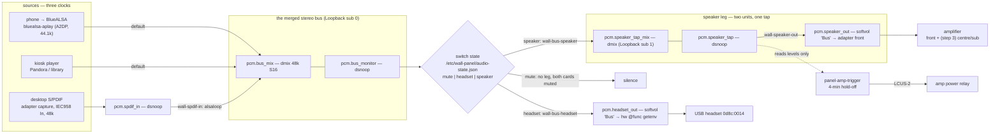

# Panel audio routing redesign — item 23, 2026-09-13

**Status:** steps 1, 2 and **3** designed and implemented on branch
`audio-routing-2026-09-13`; not deployed. Steps 4–6 are owed and listed at the
end. **Authority:** item 23 revision 2, the nine review findings, and the Owner's
rulings on them (E, F, G and rows 1–9), all in
[`HomeHub docs/PANEL_CURRENT_2026-09-13.md`](../../../HomeHub/docs/PANEL_CURRENT_2026-09-13.md).
Nothing here re-opens a ruling; where the implementation departs from the literal
wording of one, it says so and why.

## The hardware, as measured on the panel (2026-09-13 evening)

| Device | ALSA id | What it is | Measured |
|---|---|---|---|
| StarTech ICUSBAUDIO7D | `ICUSBAUDIO7D` (card 3) | 5.1 USB adapter, C-Media CM106 | playback altsets 2/4/6/8 ch @ 44.1/48 k, map `FL FR FC LFE RL RR SL SR`; **one** 2-ch capture behind `PCM Capture Source` = Mic \| Line \| IEC958 In \| Mixer; `Speaker Playback Volume` has **8 per-channel values**, 0..197 |
| USB headset adapter | `Device` (card 1) | C-Media `0d8c:0014`, hot-plug | stereo out (`Speaker`, 2 × 0..37), **mono** mic, `Auto Gain Control`; **no jack detection** |
| Built-in codec | `PCH` (card 0) | ALC255 | output-only jack; 31 dB noisier than the adapter; **retired from the audio path** |
| snd-aloop | `Loopback` (card 2) | the software bus and its tap | now `pcm_substreams=4` |
| LCUS-2 relay | `/dev/wall-amp-relay` | the only amplifier actuator | unchanged |

Two facts from that table drive the whole design:

1. **One capture stream, one selector.** Putting the desktop on S/PDIF *retires
   the 3.5 mm line-in by construction* and means a wired mic cannot share this
   adapter. The mic legs (step 4) come from the headset adapter or Bluetooth HFP.
2. **The headset adapter cannot see a cable.** D3 and D5 key on the adapter
   *enumerating*, never on a plug (review finding 1, Owner: agreed).

Also observed and worth writing down: with two USB audio devices present,
`options snd_usb_audio index=1` no longer pins the 5.1 adapter — the headset took
card 1 and the adapter landed on card 3. Nothing breaks, because every config
addresses cards by **id**, but any future work that reaches for an index is
wrong.

## The graph



### Why it is shaped this way

* **One dmix, three sources (spec B).** All three open `default`, which in bus
  mode is the bus. They run on three clocks, so every join is a resample — Owner
  ruling 9 says keep the alsaloop forwarder pattern and add no dmix across cards.
  **Every `dmix`/`dsnoop` in `asound-bus-mode.conf` has a slave on exactly one
  card**, and a test asserts it.
* **The detector taps the post-switch bus (finding 2), through a second loopback
  substream.** ALSA cannot observe a playback stream in flight, so the tap is a
  hop: `bus → speaker_tap_mix → speaker_tap → adapter`. In Headset or Mute the
  two speaker units are stopped, the tap goes quiet, and the detector's ordinary
  `WALL_AMP_HOLD_OFF_SECONDS` (240 s) runs the amplifier down — **the Owner's
  "no immediate relay open" amendment falls out of the graph; there is no mode
  logic in the actuator at all**, and a test asserts that absence.
* **The tap is upstream of the volume control**, deliberately: a listener who
  turns the music down must not switch the amplifier off underneath themselves.
* **The rejected alternative** was ALSA's `type file` plugin writing a FIFO copy
  of the speaker stream — one fewer hop and zero added latency, but a FIFO whose
  reader dies blocks the writer, i.e. a crashed detector would silence the room.
  The loopback hop cannot do that.
* **Latency, said out loud.** Desktop audio used to take the direct path for
  lip-sync; one merged bus makes that impossible. Both hops request 30 ms
  (`--tlatency 30000`) for about 60–80 ms end to end, against the kiosk leg's
  100 ms. If the Owner hears lip-sync error, the knob is `wall-spdif-in`'s
  latency, not a second path.

## The mode file

`/etc/wall-panel/audio-mode` keeps its job (`trigger|panel|**bus**`) and gains a
third value. The switch itself is a **sibling** file, because it is a different
kind of fact — an Owner choice rather than an image configuration — and because
a JSON document with five fields does not belong in a file other scripts read
with `cat`.

`/etc/wall-panel/audio-state.json`, mode 0644, owned by `wall-audio-output`:

```json
{
  "version": 1,
  "output": "speaker",              // mute | headset | speaker
  "input_muted": false,             // the separate mic button (ruling E)
  "volume": { "speaker": 60, "headset": 60 },   // per output (ruling F), 0..100
  "headset_present": false,         // 0d8c:0014 enumerated right now
  "headset_autoswitch_armed": true, // the one-shot latch (D5 amended)
  "request_seq": -1                 // last broker request applied
}
```

`headset_present` and `headset_autoswitch_armed` are **set from what coldplug
sees and never acted on** — see "A plug-in is an event; a boot is not" below.

Every field falls back **independently** if the file is damaged, and the
replacement is journaled. The whole of the decision logic is
`stack/autoinstall/wall/wall_audio_state.py` — pure, no I/O, 100 % exercised by
tests. `plan()` in that module is the single definition of what each position
means.

### Who writes it, and how the privilege boundary holds

The broker (`stack/panel-audio`, SR-023) runs as `panel` with
`ProtectSystem=strict` and `AF_UNIX` as its only address family: it can neither
write `/etc` nor talk to systemd, and this design does not change that.

```
renderer ──IF-015──▶ broker (panel)  ──▶ /run/wall-audio-router/request.json
                     (the backend that writes it is STEP 5; today the
                      shipped backend refuses every mutation, by SR-023)
                                           │  (switch_request.py, atomic, seq'd)
                          wall-audio-apply.path (PathChanged)
                                           ▼
                       wall-audio-output apply-request  (root, oneshot)
                                           ▼
                    audio-state.json  +  systemctl / amixer  +  journal
```

The request carries a `seq` and one of four event kinds — `set_output`,
`set_input_mute`, `set_volume`, `nudge_volume` — and **never** a card, unit or
mixer name. `headset` is refused from a request: adapter presence is the
kernel's fact, reported by udev, and a renderer able to assert it could talk the
panel into silence (ruling 7). `seq` is recorded in the same atomic write as the
change it caused, because `systemd.path` fires on every close-write and a
replayed rocker press walks the room's volume down on its own.

### A plug-in is an event; a boot is not (Owner ruling, 2026-09-13)

**Measured on the panel at 23:18, with bus mode installed live and acceptance
checks 1–10 run.** After a power cycle with the USB headset adapter
(`0d8c:0014`) already plugged in, `wall-headset-present.service` ran at boot
alongside `wall-audio-state.service`, logged *"headset adapter present"* and then
*"auto-switch speaker -> headset (one-shot)"* — so the panel came back on
**Headset** although it had been left on **Speaker**.

**Owner ruling:** the position must persist through a power cycle, including the
last setting, regardless of whether the adapter is plugged in over the boot. The
dynamic switch on plug-in is an **event**, and over a boot we do not know when
that event occurred or whether it is still relevant.

So a presence report now carries *which kind of report it is*, and only a
**runtime add** — the adapter enumerating while the system is already up — may
move the switch. A **coldplug** report records `headset_present`, sets the latch
(spent if the adapter was present across the boot, armed if it was absent, so
acceptance check 8 still passes on a panel that booted bare) and touches
`output` never. `apply-state` itself issues one coldplug report, which is also
what keeps `headset_present` from being a stale value carried over from the last
boot.

**How the two are told apart, and why this mechanism.** Three were available:

| | Why not |
|---|---|
| An `/proc/uptime` threshold | A guess with a number in it, and the number is wrong on exactly the boot that is slow enough to matter: a USB bus that enumerates at t+12 s on a cold morning fires the one-shot against the ruling. |
| An explicit `--boot` flag set by the udev rule | A udev rule cannot tell coldplug from hot-plug honestly — the synthetic-event properties differ by systemd version — and a flag baked into the rule would also be wrong for every runtime re-trigger. |
| **Two gates over one monotonic clock — chosen** | See below. |

`is_boot_presence` in `wall-audio-output` is **two gates, not one**, and the
second review round is why:

* **Gate 1 — has the boot finished at all?** While `systemctl is-system-running`
  answers `initializing` or `starting`, a device appearing is still plausibly
  coldplug and the Owner's stored position wins. **A slow boot stays `starting`
  for longer all by itself**, so there is no number here to be wrong about. The
  first draft used `Wants=systemd-udev-settle.service` for this and the review
  was right to reject it: settle drains the queue it can *see* and promises
  nothing about an adapter behind a slow hub that enumerates a second later —
  which would have had `USEC_INITIALIZED` after the stamp and fired the one-shot
  against the ruling. Settle is now **not used at all**.
* **Gate 2 — did this device predate the stored position?** `USEC_INITIALIZED`
  is when udev first processed *this* device; the stamp in
  `/run/wall-panel/audio-boot-apply.json` is what `apply-state` **sampled when it
  began** applying the stored position and **published when the apply landed**.
  Both halves matter: publishing early would declare the boot settled while the
  legs were still moving, and sampling late would classify a plug that arrived
  *during* the apply — whose presence unit is sitting on the apply flock waiting
  — as coldplug and swallow a real one. This gate is what catches the reports
  that arrive long after boot: a `udevadm trigger`, a manual `systemctl start`,
  the presence unit being re-run.

And one gate in the **policy**, which is where it belongs: a runtime add for an
adapter the state already believed present is **not an arrival**, moves nothing,
and — importantly — **does not spend the latch**, because spending it there would
eat the next real plug.

Ordering: `wall-headset-present.service` is `After=wall-audio-state.service`, so
**the stored position is applied before any presence report is acted on**.
Ordering only, no `Wants=`: in `trigger` or `panel` mode the state unit is
disabled and the presence reporter must still be able to record what is plugged
in.

Every doubt resolves to **coldplug**: gate 1 unanswerable (no `systemctl`), no
`USEC_INITIALIZED`, no `udevadm`, a negative or unparseable stamp. The worst case
is then an Owner who moves the switch by hand; the alternative failure is a panel
that moves it for them, which is the one the ruling forbids. A `remove` is always
a runtime event — a device that is not there cannot have been coldplugged. The one
deliberate exception is a **booted** system with no stamp at all (`/run` cleared,
or the state unit never ran): that reads as runtime, so a genuine plug still
works, and the policy's own "already present" refusal is what stops it firing for
a device that never went anywhere.

**Accepted, not fixed:** moving the USB hub with the headset adapter on it
(acceptance check 12) re-enumerates the adapter and therefore *is* a headset
event by D5's own definition — remove re-arms, add switches. There is no signal
that separates it from a replug, and D5 says the adapter enumerating is the
event.

**The bug the review caught before the panel did:** `headset_syspath` first
looked the ALSA **id** up under `/sys/class/sound`. sysfs names that entry
`cardN`; the id (`Device`, for this nameless C-Media part) has no sysfs entry at
all, so `udevadm` would never have been asked, every plug would have read as
coldplug, and **no runtime auto-switch would ever have fired again** — a silent,
permanent D5 regression with green tests above it. The card *number* now comes
from the parent directory of the same `/proc/asound/cardN/usbid` that finds the
card, and a test asserts the difference.

`wall-audio-output headset add` also takes `--boot` and `--runtime` for a caller
that already knows. The udev path passes neither, on purpose.

### The broker's protocol surface

* **`set_output {output: mute|headset|speaker}`** — `set_mute` generalized.
  `set_mute {muted}` stays accepted for one release (an older shell keeps its
  button) and is removed with the chrome in step 5.
* **`set_input_mute {muted}`** — the separate mic button of ruling E.
* **`set_output` is NOT `select_output`.** `select_output` routes to a trusted
  *Bluetooth device* by alias and predates this work. They were nearly merged;
  keeping them apart is what stops a device alias ever reaching the host switch.
  Both names are now commented at the definition.
* **`status.switch`** (new, optional block, positive schema):
  `{supported, output, inputMuted, available, reason, volume}`. `available:false`
  with `output:"headset"` is the **red icon** of ruling 7. `reason` is a short
  token (`headset_absent`), never a device or card name.
* **Reconciliation is now method-aware.** `set_mute` is settled by reading the
  `mute` block; `set_output`/`set_input_mute` by the `switch` block. Settling a
  lost `set_output` on the mute control would be the sticky-pending failure
  dressed up as an observation — a three-position switch is not a boolean.

### The item 20 overlay event (defined here, renderer work is D-2/step 5)

Host → renderer, over the existing preload bridge, on every accepted level
change and on every output change:

```js
// channel: 'panel:audio-level'
{ version: 1,
  output: 'speaker' | 'headset' | 'mute',
  volume: 0..100,            // the selected output's level
  inputMuted: false,
  available: true,           // false + output 'headset' ⇒ red
  reason: null | 'headset_absent',
  monotonicMs: 12345678 }    // host monotonic clock, for de-duplicating bursts
```

The renderer shows a transient fading indicator; it must treat a missing event
as "no change", never as zero. **Not implemented in the renderer here.**

## Units and configuration changed or added

| File | New? | What it does |
|---|---|---|
| `asound-bus-mode.conf` | new | the whole bus-mode graph (bus, tap, both legs, S/PDIF capture, `!default`) |
| `wall-audio-mode` | changed | third mode `bus`; `apply_bus()`; stops the new forwarders before the IPC sweep; status lists them |
| `wall-spdif-in.service` | new | adapter capture (selector → `IEC958 In`) → bus; successor to `wall-line-in` |
| `wall-bus-speaker.service` | new | bus → `speaker_tap_mix` |
| `wall-speaker-out.service` | new | `speaker_tap` → `speaker_out` (softvol → adapter front) |
| `wall-bus-headset.service` | new | bus → `headset_out`; bound to the headset alias |
| `wall-headset-present.service` | new | `BindsTo` the headset alias; start = "add", `ExecStop` = "remove" |
| `wall-audio-apply.path` / `.service` | new | the broker's request → the root applier |
| `wall-audio-state.service` | new | re-assert the stored position at boot **and on resume** (ruling G, item 16) |
| `wall-audio-output` + `wall_audio_state.py` | new | the applier and its pure core |
| `91-wall-headset-adapter.rules` | new | `0d8c:0014` → `/dev/wall_headset_adapter` alias |
| `wall-aloop.conf` | changed | `pcm_substreams=4` (bus + tap, two spare) |
| `audio-cards.conf.example`, `wall-firstboot.sh` | changed | `card_loop_tap_play/cap`, `ctl.card_loop_ctl`; installs every file above |
| `panel-amp-trigger.py` | changed | `sources_for(mode)`; bus mode watches **only** `speaker_tap`; `bus` joins `trigger` in `COMMANDING_MODES` |
| `panel-volume-keys.py` | changed | in bus mode the rocker calls `wall-audio-output volume up\|down`; the `KEY_MUTE` key is inert **and says so** |
| `routing.py`, `audio_router.py`, `switch_request.py` | changed/new | `set_output`, `set_input_mute`, the `switch` status block, method-aware reconciliation, the request writer |

**Three properties the units hold, each asserted by a test:**

1. **No leg is ever `enable`d.** A boot must not start audio in a position the
   Owner did not leave it in; `wall-audio-state.service` applies the stored one.
2. **Every forwarder `BindsTo` a device alias and runs under
   `wall-alsaloop-guard.py`** — item 25's two lessons, applied to the new units.
3. **Bus mode is additive.** `asound-trigger-mode.conf` and `wall-line-in` are
   left installed, so `wall-audio-mode trigger` is a one-command rollback with
   the Owner in the room. That is the entire reason `bus` is a third mode rather
   than a rewrite of `trigger`.

## One implementation deviation, and one note for the glass test

**Not an open spec item.** Item 23 is settled ("Nothing open on item 23 after
this round"); what follows is an implementation choice inside ruling F, recorded
here so it is visible rather than buried, and worth one sentence at the glass
test. It does not gate the merge. Ruling F says the
level is applied to the merged bus "before it reaches any path". It is applied at
the *end of each leg* instead: one softvol, declared once, named once, living on
the always-present Loopback card, and only ever one leg running. The reason is
concrete — a gain on the bus itself sits **upstream of the detector's tap**, so
turning the music down would walk the signal towards the amplifier's threshold
and eventually switch the amplifier off underneath the listener. The alternatives
are (a) this, (b) the gain on the bus with the detector's thresholds made
volume-aware, which puts the volume back into the actuator that finding 2 just
took it out of, or (c) two gains, which is two things to get out of step. The
behaviour the Owner asked for — one control, everything moves, remembered per
output — holds in all three; only the tap's reading differs. **Implemented: (a).** Mentioned to
the Owner at the glass test as a courtesy, not as a question that holds the
branch; if the Owner would rather the gain sat on the bus, (b) is a small change
to this file plus volume-aware thresholds in the detector.
**Deviation, not open:** the rocker's `KEY_MUTE` is inert in bus mode rather
than mapping to the Mute position — a one-way mute from a key that cannot un-mute would strand the
  panel silent for anyone not standing at it. Step 5 gives the state a
  previous-output memory and the key a real toggle.

## Things the first review caught, and where they landed

The adversarial review (Codex `gpt-5.6-terra`, medium) is summarized here because
four of its findings are now load-bearing comments in the code and one is a
measurement worth keeping:

* **The boot unit could not do the resume half.** `RemainAfterExit=yes` means it
  stays active for the life of the boot, so wanting it from a sleep target
  starts an already-active unit and runs *nothing* — ruling G quietly unmet with
  a green status above it. Split into `wall-audio-state.service` (boot) and
  `wall-audio-resume.service` (no `RemainAfterExit`, wanted by and ordered after
  the four sleep targets).
* **Four callers, one graph.** udev, the rocker, a broker request and the
  boot/resume re-assert can all run the applier at once; atomic writes prevent a
  torn file but not a lost update, and two applies can start and stop opposing
  legs. The applier now holds an exclusive `flock` across the whole of load →
  decide → save → apply. `status` is the one command that does not take it.
* **The level could be set before the control existed.** `softvol` creates its
  control when a client opens the PCM, and `systemctl start` on a `Type=simple`
  forwarder returns at fork. Setting the level once would leave a freshly started
  leg at the plugin default — full scale. Now retried for up to 2 s, quietly,
  and journaled if the control never appears.
* **A per-lifetime request counter would strand the switch.** The applier keeps
  the high-water mark in `/etc`; a broker restarting at zero would have every
  request silently discarded. `switch_request.next_seq()` is now a wall-clock
  nanosecond stamp, and a refused sequence is journaled rather than dropped.
* **The state-repair check was a tautology** (it compared a normalized state
  with itself). It now compares the loaded document field by field and names
  what it replaced.
* **One finding was wrong, and the measurement is worth keeping.** The review
  held that `/proc/asound` has no id-named symlinks. It does — read off the panel
  tonight: `Device -> card1`, `ICUSBAUDIO7D -> card3`, `Loopback -> card2`,
  `PCH -> card0`. The code was moved to `/proc/asound/cardN/id` anyway, which is
  a plain read that cannot be confused by an id differing only by a suffix.
* **Two things the review confirmed rather than faulted:** the new ipc_keys
  (7713, 7714, 8822–8824) do not collide with trigger mode's, and the loopback
  capture stalling when playback closes is already handled by the detector's
  1 s staleness rule — so the OFF path still runs.
* **Standing limitation, accepted:** the graph tests read configuration text.
  They cannot prove ALSA parses the file or that audio is audible; that is what
  the on-glass acceptance is for, and it is why the install sequence below ends
  with three sources playing at once rather than with a green test run.

## Step 3 — the centre/sub leg (D4, review finding 8)

**Owner D4, verbatim in effect:** in Speaker position the front output stays
stereo and an (L+R)/2 mono signal goes to **both** the centre channel and the
LFE channel. Front out and centre/sub out are both wired to the amplifier; the
subwoofer is assumed to have its own low-pass, so nothing here band-limits it.

### What the hardware actually offers, re-measured 2026-09-14

`cat /proc/asound/card3/stream0` on the panel:

| Altset | Channels | Format | Rates | Map |
|---|---|---|---|---|
| 1 | **8** | S16_LE | 44.1 / 48 k | `FL FR FC LFE RL RR SL SR` |
| 2 | 2 | S16_LE | 44.1 / 48 k | `FL FR` — **what the leg opened before this step** |
| 3 | 4 | S16_LE | 44.1 / 48 k | `FL FR FC LFE` |
| 4 | 6 | S16_LE | 44.1 / 48 k | `FL FR FC LFE RL RR` |

The map is `chmap-**fixed**` per altset (numid 1), so it is not negotiable — and
does not need to be, because it is already the order the `ttable` is written in.
`channels 8` on the slave is the whole of how altset 1 is selected.

`Speaker Playback Volume` (numid 8) is eight independent values, 0..197,
-36.93 dB to 0 dB, read on 2026-09-14 as **66,66,24,24,0,0,24,24** — the rear
pair deliberately at zero, which is the state the earlier note asked for and
already has. Those are **left alone**: see "two trims" below.

### The chain

```
alsaloop (2 ch S16 48k)
  └─ pcm.speaker_out        softvol "Bus" on the Loopback card   ← unchanged
       └─ pcm.speaker_multi type route, the generated ttable
            └─ pcm.speaker_hw8  type plug → card_usb, channels 8, S16_LE, 48 k
```

Three things follow from that order and each is deliberate:

* **The up-mix is BELOW the volume**, so the Owner's one control moves front,
  centre and sub together and stays one control (ruling F).
* **The leg still forwards two channels.** `wall-speaker-out.service` is
  unchanged in its `alsaloop` arguments; nothing upstream of `speaker_out`
  knows there are eight channels, so the tap, the detector and the headset leg
  are untouched.
* **The detector's tap is unaffected, and cannot be.** It reads `speaker_tap`,
  which is a loopback substream two hops upstream of `speaker_out`. The whole of
  step 3 is below it.

The ttable, with the day-one defaults:

| | → FL (0) | → FR (1) | → FC (2) | → LFE (3) | → RL/RR/SL/SR (4–7) |
|---|---|---|---|---|---|
| **L (0)** | 1.0 | 0.0 | 0.5 | 0.5 | 0.0 |
| **R (1)** | 0.0 | 1.0 | 0.5 | 0.5 | 0.0 |

Channels 4–7 are rendered as **explicit zeros** rather than left out, because
"silent on purpose" and "forgotten" must not look the same in a generated file —
and because rear is wired to the desktop's input (item 23 revision 2), where the
room's music must never appear.

### Where the trim lives, and why it is not in this file

Review finding 8 asked for a per-channel trim "from day one"; the Owner ruled
that the tuning itself is **a dedicated effort after everything else is in**.
That session happens standing at an amplifier, one number at a time. So the six
coefficients are a **generated pair of files**, exactly like the card map:

| File | Who writes it | Who reads it |
|---|---|---|
| `/etc/wall-panel/audio-trim.env` | firstboot (seed, only if absent) and `wall-audio-output trim` | `wall-audio-output` |
| `/etc/wall-panel/audio-trim.conf` | `wall-audio-output trim` | ALSA, as the only definition of `pcm.speaker_multi` |

```sh
sudo wall-audio-output trim                       # show the table and both paths
sudo wall-audio-output trim center=0.35 sub=0.6   # both halves of the mono sum
sudo wall-audio-output trim front_l=0.95          # per channel, if the room is odd
```

Each of those rewrites both files and **restarts the speaker leg if it is
running** — ALSA reads a plugin's configuration when the PCM is *opened*, so a
running leg keeps the table it started with. It never starts a leg that was
stopped: a command that only moves a number must not put audio in the room, and
the "is it running" probe therefore counts a missing or erroring `systemctl` as
**not running**. A refused value moves **nothing at all**: a session that types
three changes and fat-fingers the fourth must not be left with the first three
applied and no idea which. Negative is refused (a phase inversion on a summed
mono feed is a cancellation, not a trim) and so is anything above 4.0 (+12 dB),
which is a wiring problem.

`WALL_AUDIO_TRIM_*` in `wall.env` are the values a **fresh** panel starts at.
Firstboot writes `audio-trim.env` only if it is absent — the amp-trigger.env
rule — so a re-run never discards numbers somebody arrived at by listening. To
reset a panel to the seeds, delete the file and re-run firstboot.

**Two trims, and which one moves.** The adapter's own eight hardware values are
per-*channel*; the ttable is per-*channel and per-source*, so "less of the right
channel in the sub" is expressible in one and not in the other. The tuning
session moves the ttable; the hardware values stay where the Owner's bench work
put them.

### The fallback, and the one mechanism that makes it safe

ALSA configuration has no conditionals, so "8 channels if the adapter has them"
had to become a name the applier chooses. `speaker_out`'s slave is
`{@func getenv vars [WALL_AUDIO_SPEAKER_CHAIN] default "speaker_multi"}` — the
same trick the headset card already uses. On every apply that wants the speaker
leg, `wall-audio-output` **probes** the multi chain with
`aplay -q -D speaker_multi /dev/null` (opens, writes no frames, exits, nothing
audible), writes the answer to `/run/wall-panel/audio-speaker.env` for
`wall-speaker-out.service`'s `EnvironmentFile=`, **and puts it in its own
environment** — because `@func getenv` reads the environment of whichever
process opens the PCM, and the applier's own softvol pre-open moments later is
its own child. Without that second half the pre-open would declare the control
on a chain the leg was not going to use.

**One probe answers both ways the multi chain can be unavailable:** an adapter
that refuses the 8-channel altsetting (a different model dropped into the same
role — the CM106 here has one, measured, but nothing requires the part), and a
missing or unparseable `audio-trim.conf`. The fallback, `speaker_stereo`, is
*exactly* what shipped before step 3, so the worst case is the panel we already
had, with a journal line naming both things to check.

That is also why the trim file is loaded with

```
@hooks [ { func load files [ { file "/etc/wall-panel/audio-trim.conf" errors false } ] } ]
```

rather than a plain `</...>` include. **`errors false` is load-bearing:** a hard
include of an absent file aborts the *whole* configuration — the bus, the
headset leg and `pcm.!default` with it, i.e. silence everywhere because a
generated file went missing. With the hook, an absent file leaves only
`speaker_multi` undefined, the probe fails, and the leg plays stereo. Both
halves of that are asserted against real `alsa-lib` (see the tests below).

### The boot-minute underruns: the first answer was a deadlock

Measured on the 2026-09-14 00:13 reboot: **58 `speaker_out` underruns confined
to 00:14:18-00:15:13, and zero afterwards.** The Owner heard them as skipping
during boot and nothing later. The window is exactly firstboot's re-run, the
kiosk session restarting and the USB tree enumerating, competing for the same
CPU and the same USB host controller.

**`After=wall-firstboot.service` was written first, and adversarial review
(terra, medium) found it a first-boot deadlock before the panel did.** Nothing
in the speaker leg is started by a boot target -- that is a deliberate property
of steps 1-2, "no leg is ever `enable`d". The chain is:

```
wall-firstboot.service  (running)
  └─ wall-audio-mode bus                       (synchronous)
       └─ systemctl restart wall-audio-state   (synchronous, waits)
            └─ wall-audio-output apply-state
                 └─ systemctl start wall-speaker-out.service   ← waits for the job
```

Order that last job after `wall-firstboot.service` and systemd parks it behind
firstboot's own still-running job -- while firstboot is blocked waiting for the
start to return. First boot hangs to its timeout and fails to provision. The
ordering was **incoherent as well as dangerous**: firstboot cannot be a unit
this leg starts *after* when firstboot is the thing that starts it. Withdrawn,
and a test asserts the whole call chain so that nobody re-adds the line without
meeting it.

**So it is the larger buffer after all, and on one half only.**
`wall-speaker-out.service` goes from `--tlatency 30000` to `--tlatency 50000`;
a larger ring tolerates a longer scheduling gap, which is precisely what the
boot minute is. `wall-bus-speaker.service` keeps 30 ms: the measured underruns
were on `speaker_out`, not on the tap, and buying the tolerance twice would pay
for the boot minute twice.

**The cost, said out loud.** About 20 ms of end-to-end latency on the speaker
path, taking it from roughly 60-80 ms to 80-100 ms -- still under the kiosk
leg's own 100 ms. The design's stated lip-sync knob (`wall-spdif-in`'s latency)
is untouched and still available, and if the Owner hears lip-sync error at the
glass test this number is the first one to put back. That is the trade this
design would rather not have made; the alternative was a first boot that does
not finish.

### Files step 3 changes or adds

| File | New? | What it does |
|---|---|---|
| `asound-bus-mode.conf` | changed | `speaker_hw8` (8-channel open), `speaker_stereo` (the fallback), `speaker_out`'s slave chosen by `@func getenv`, the `errors false` hook that loads the trim |
| `audio-trim.conf.example` | new | what the generated `pcm.speaker_multi` looks like, and why it is generated |
| `wall-audio-output` | changed | `trim` subcommand, `load_trim`/`render_trim_conf`/`render_trim_env`, `probe_speaker_chain`/`select_speaker_chain`, trim and chain in `status` |
| `wall-speaker-out.service` | changed | `EnvironmentFile=` for the chain; `--tlatency` 30 ms to 50 ms for the boot minute |
| `wall-bus-speaker.service` | changed | comment only: why the withdrawn ordering is not here either |
| `wall-firstboot.sh` | changed | seeds `audio-trim.env` if absent, then renders `audio-trim.conf` |
| `wall.env.example` | changed | the six `WALL_AUDIO_TRIM_*` seeds and what they mean |

**Unchanged, and asserted so:** the headset leg, the detector's tap and its
sources, `wall_audio_state.py` (step 3 adds no state and no policy — the trim is
a property of the room, not of the switch), and the broker's protocol surface.

### Tests

* `tests/test_wall_audio_switch.py` — 18 new cases: the 8-channel open, the mono
  sum reaching FC and LFE *identically*, front staying stereo, the explicit rear
  zeros, the day-one defaults agreeing with `wall.env.example` and firstboot,
  the group and per-channel trim names, five refusals that each move nothing,
  field-by-field fallback of a damaged trim file, the env round trip, the
  `errors false` hook, the probe answering both failure modes, the chain
  reaching both the leg and the pre-open, probe-before-declare-before-start, no
  probe in Mute or Headset, the ordering choice (and the absence of `Wants=`),
  the install-only-if-absent rule, and the "never starts audio" refusal.
* **`test_the_generated_alsa_config_parses_sr028` asks `alsa-lib` itself** —
  `aplay -L` over the real `asound.conf` + `audio-cards.conf` + this mode file +
  the generated trim, with the absolute include paths rewritten into a temp
  tree. It asserts every PCM name resolves, then deletes the trim file and
  asserts that `bus`, `speaker_out` and `speaker_stereo` **survive** while
  `speaker_multi` is the only casualty. Skipped where alsa-lib is absent (the
  dev box); run under `wsl -d Ubuntu`, which is where it was proven, and which
  is the first time anything in this design has had ALSA parse it.
* `stack/autoinstall/wall/tests/audio-switch.test.sh` — B11, B12, B13 on the
  real applier: the probe order and its publication, nothing probed in Mute or
  Headset, and the whole trim command including its refusals. 64 PASS 0 FAIL.

### Install and acceptance for step 3

Run with the Owner present, and **verify which physical jack each pair drives
before wiring the amplifier** — the front pair and the centre/sub pair are both
going to the amplifier, and getting them the wrong way round is a room with no
bass and a very loud centre.

```sh
# 1. Payload in place, then the audio block, which seeds and renders the trim.
sudo /opt/wall-panel/stack/autoinstall/wall/wall-firstboot.sh
cat /etc/wall-panel/audio-trim.conf          # expect pcm.speaker_multi, 0.5s to FC and LFE

# 2. Re-apply the position so the leg is restarted onto the new chain.
sudo wall-audio-output set speaker
sudo wall-audio-output status                # expect "speaker_chain": "speaker_multi"
                                             # and the six trim values

# 3. The adapter should now be in its 8-channel altsetting while audio plays.
cat /proc/asound/card3/stream0 | head -8     # expect Altset = 1, 8 channels
```

| # | Do this | Expect |
|---|---|---|
| S3-1 | `wall-audio-output status` with the switch on Speaker and audio playing | `"speaker_chain": "speaker_multi"`; `/proc/asound/card*/stream0` shows the running altset at **8 channels** |
| S3-2 | **The tone test.** Play a stereo test tone with different content in L and R (e.g. `speaker-test -D speaker_out -c 2 -t sine`), and listen at the centre/sub output with the front output disconnected | **Centre and sub carry the SAME signal**, and it is the sum of both stereo channels — a tone present only in L is audible on centre and on sub at half level, and so is one present only in R |
| S3-3 | Same tone, listening at the **front** output | **Still stereo**: a tone only in L is silent on the right front channel |
| S3-4 | Music through the library player, on Speaker, with the subwoofer connected | the **sub plays**, and the room is not obviously centre-heavy; note anything that wants trimming for the tuning session |
| S3-5 | `sudo wall-audio-output trim sub=0.35`, with music still playing | the sub drops within about a second (the leg restarts); `wall-audio-output trim` shows the new value; **the front output does not change** |
| S3-6 | The rocker, or `amixer -c Loopback sset Bus 40%` | front, centre and sub **all** follow: one control, ruling F |
| S3-7 | `journalctl -u wall-amp-trigger -f` while doing S3-4 | the relay closes as before: the tap is upstream of every part of step 3 |
| S3-8 | `sudo mv /etc/wall-panel/audio-trim.conf /tmp/` then `sudo wall-audio-output set speaker` | audio still plays, **stereo front only**, and the journal says the 8-channel chain would not open and names both things to check. Put the file back and re-apply. |
| S3-9 | Reboot, and watch the first two minutes | `journalctl -u wall-speaker-out --since -3min` shows **no underrun burst** (the 58 of 2026-09-14); the Owner hears no skipping during boot. **Firstboot must also complete normally** -- `systemctl status wall-firstboot` green, not timed out |
| S3-9a | With the desktop playing video over S/PDIF on Speaker | ask the Owner about lip-sync: this step added about 20 ms. If it reads wrong, `--tlatency` in `wall-speaker-out.service` is the number to put back to 30000 |
| S3-10 | Headset position, and Mute | unchanged from steps 1–2 in every respect; `status` shows no probe and the adapter is not opened |

## What steps 4–6 still owe

3. **Speaker leg, 8 channels (D4, supersedes item 17). DESIGNED AND IMPLEMENTED
   — see "Step 3" below.** Not deployed; the install and acceptance are there too.
4. **Mic legs (C, D3, D4).** Headset mic (`Device` mono capture) or Bluetooth
   HFP mic → the adapter's rear out and the Bluetooth mic return. Needs a
   second capture path; the 5.1 adapter's single capture stream is spent on
   S/PDIF. `input_muted` is already in the state and applied to the headset
   card's `Mic` capture switch; the rest of its meaning lands here.
5. **Chrome (the triple switch + input mute) — and the broker backend that
   actually calls `switch_request`.** Today nothing does: the shipped broker is
   still `UnavailableBackend`, which refuses every mutation (SR-023, unchanged),
   so `switch_request.py` is a *seam* with its validation and its tests, not a
   live path. The working paths today are the `wall-audio-output` CLI, the udev
   presence unit and the rocker. This is on the critical path for the chrome and
   is called out so nobody reads the arrow in the diagram as already flowing. Upper-left, above every view
   including FULL and the attention takeover; per-output volume memory shown;
   red headset icon driven by `status.switch.available`. Also here: the
   `panel:audio-level` overlay (item 20), retiring `set_mute`, giving `KEY_MUTE`
   a previous-output memory, and pointing `bluealsa-aplay` at the `Bus` control
   (`--mixer-device`/`--mixer-name`) so phone volume stops logging *"Couldn't
   open ALSA mixer: Master"*.
6. **Amp trigger re-proven in every position** (F4/F7/F8), including: audio on
   Speaker closes the relay; moving to Headset or Mute leaves it closed for the
   hold-off and then opens it; a headset unplugged while in Headset leaves the
   relay alone.
* **AEC spike (D-3a, before step 3).** The reference signal the spike needs is
  `speaker_tap` — but note it is **pre-volume**, so an AEC that uses it must
  apply the same gain the leg does, or estimate it.
* **Also owed:** the hub-that-answers-with-no-children reset from the item 25
  addendum, and the BlueALSA power-off-on-unverified-close question from D-1.

## Install and acceptance for steps 1–2

**Run with the Owner present: this changes the live audio graph.** The rollback
is one command at every point: `sudo wall-audio-mode trigger`.

### Install

```sh
# 0. From the dev box, with the branch merged into the panel payload as usual.
#    Nothing here is deployed by this session.
ssh panel@<panel>
sudo systemctl status wall-line-in wall-kiosk-loop wall-amp-trigger   # note what is running
cat /etc/wall-panel/audio-mode                                        # expect: trigger

# 1. Payload in place (whatever the release lane does today), then firstboot's
#    audio block, which installs the new configs, units, rules and scripts and
#    regenerates the card map with the tap subdevices.
sudo /opt/wall-panel/stack/autoinstall/wall/wall-firstboot.sh   # or the lane's install step

# 2. The loopback needs its extra substreams, and the module cannot be reloaded
#    under a live graph. Reboot, or unload with the audio units stopped:
sudo systemctl stop wall-line-in wall-kiosk-loop wall-amp-trigger
sudo modprobe -r snd_aloop && sudo modprobe snd_aloop
cat /proc/asound/Loopback/pcm0p/sub1/info >/dev/null && echo "tap substream present"

# 3. Switch the chain.
sudo wall-audio-mode bus
wall-audio-mode status          # expect mode: bus, chain: asound-bus-mode.conf
sudo wall-audio-output status   # expect output speaker, plan with both speaker legs true
```

### Acceptance, in order, each with its evidence

| # | Do this | Expect |
|---|---|---|
| 1 | `aplay -L \| grep -E "^(bus\|bus_monitor\|speaker_tap\|spdif_in)$"` | all four PCMs resolve; no ALSA parse error in `dmesg`/stderr |
| 2 | Play a test tone: `aplay -D bus /usr/share/sounds/alsa/Front_Center.wav` | heard on the amplifier; `journalctl -u wall-amp-trigger -f` shows the relay close |
| 3 | **Three at once (step 1's acceptance):** desktop playing over S/PDIF, phone connected and playing over A2DP, kiosk playing the library | **all three audible together** on the front output, none cutting another off |
| 4 | `amixer -c Loopback sset Bus 40%` then `80%` | the room follows; `journalctl -u wall-amp-trigger` shows the level at the tap **unchanged** (the tap is pre-volume) |
| 5 | Rocker up/down | `journalctl -t wall-audio-output` shows `speaker volume N% -> M%`; the room follows |
| 6 | `sudo wall-audio-output set headset` with the headset adapter plugged in | audio moves to the headset; the amplifier does **not** open immediately; `journalctl -u wall-amp-trigger` shows it opening about 4 minutes later |
| 7 | `sudo wall-audio-output set speaker`, then unplug the headset adapter, then `set headset` | silence on every output; `journalctl -t wall-audio-output` says the adapter is absent; `wall-audio-output status` reports `reason: headset_absent` |
| 8 | Plug the headset adapter back in while on Speaker | switches to Headset **once**, journaled `auto-switch speaker -> headset`; `set speaker` then replugging a `change` event does **not** switch again |
| 9 | `sudo wall-audio-output set mute` | silence; the amplifier opens after the hold-off, not before |
| 10 | Reboot **with the adapter unplugged** | comes back in the position it was left in; `journalctl -u wall-audio-state` shows one apply |
| 10a | Leave the switch on **Speaker**, leave the headset adapter **plugged in**, power cycle | comes back on **Speaker**. `journalctl -t wall-audio-output` shows `headset adapter present at boot: recorded, no auto-switch (output stays speaker)` and **no** `auto-switch speaker -> headset`. This is the 23:18 regression and the Owner's ruling. |
| 10b | Then, still up, unplug the adapter and plug it back in | switches to Headset once — the runtime event still works, and check 8 is unaffected |
| 11 | Sleep and wake (or `systemctl suspend`) | same, via `wall-audio-resume`; audio works without a manual restart |
| 12 | Move the USB hub to another port with music playing (item 25 regression) | within ~10 s the amplifier is on and audio is audible; the journal shows the bound units cycling once |

### Three wrinkles found by the live install of 2026-09-13, and fixed

1. **`wall-audio-mode bus` logged `amixer sset Bus 60%` failing.** `softvol`
   creates its control when a **client opens** the PCM that declares it
   (`speaker_out` / `headset_out`, never `bus`), and on the first apply after a
   whole-graph swap there may be no client for longer than any retry window
   worth having. Waiting harder only makes the window a bigger guess, so the
   applier **opens the leg's own PCM itself** — `aplay -q -D speaker_out
   /dev/null`, which opens, writes no frames and exits, so the control exists
   afterwards and not one sample reaches the room. It is done **before the leg
   starts**, and the remembered level is set there and then: review found that
   creating the control *after* the forwarder is running leaves a window in which
   a freshly created softvol sits at its default — **full scale** — with audio
   already flowing through it. The retried set at the end of the apply stays, as
   the belt to that brace. The pre-open is never required and carries its own
   short (5 s) timeout, because it runs while the apply flock is held and an
   ALSA open that wedges must not hold the switch. In Mute (and in Headset with
   no adapter) no PCM is opened at all: the control legitimately does not exist,
   and opening one would start audio nobody asked for.
2. **`bluealsa-aplay` and `wall-audio-state` were left stopped afterwards.** Two
   separate causes. `bluealsa-aplay` is stopped unconditionally — it is a client
   of `default`, consequence 1 of the mode script — but was only started again
   if it was *enabled*, and a unit that is merely **running** reads as
   `disabled`; the script now remembers what was active before the sweep, and a
   mode switch may leave something off that was already off but may not turn off
   something that was on. `wall-audio-state.service` was only ever *enabled* by
   `apply_bus`, while the position was applied by calling the script behind the
   unit's back — so `systemctl status wall-audio-state` was dead and
   `journalctl -u wall-audio-state` was empty, which is exactly where acceptance
   check 10 goes looking. The mode switch now does `systemctl restart
   wall-audio-state.service` (**restart**, because the unit is
   `RemainAfterExit=yes` and starting an already-active oneshot runs nothing),
   starts `wall-audio-apply.path`, and starts `wall-headset-present.service` when
   the adapter's device unit is **active** — `systemctl is-active`, not
   `list-units`, because an unplugged device unit can stay *loaded* and inactive
   and asking for a `BindsTo=` service with no device behind it would fail the
   whole mode switch.
3. **Firstboot warned about "REPLACE_WITH placeholders" on a fully configured
   panel.** A separate bug in the same install, and not an audio one: `wall.env`
   ships its optional settings as **commented** examples that still carry
   `REPLACE_WITH_…`, and the check was a bare `grep -q`. It now filters
   `^[[:space:]]*#` first, so only live assignments count and the warning means
   something again.

### If anything in 1–12 fails

```sh
sudo wall-audio-mode trigger    # the old chain, unchanged, with the amp detector back on its old sources
wall-audio-mode status
```

Then capture `journalctl -t wall-audio-output -u wall-spdif-in -u wall-bus-speaker
-u wall-speaker-out -u wall-bus-headset -u wall-amp-trigger --since -20min` and
`sudo wall-audio-output status`, which together say what the switch believed and
what the graph did.
