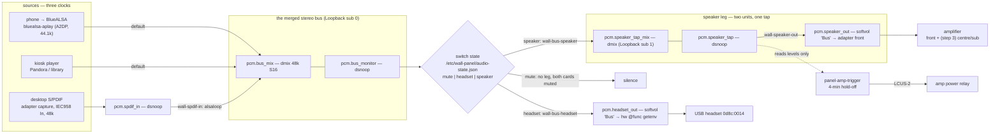

# Panel audio routing redesign — item 23, 2026-09-13

**Status:** steps 1 and 2 designed and implemented on branch
`audio-routing-2026-09-13`; not deployed. Steps 3–6 are owed and listed at the
end. **Authority:** item 23 revision 2, the nine review findings, and the Owner's
rulings on them (E, F, G and rows 1–9), all in
[`HomeHub docs/PANEL_CURRENT_2026-09-13.md`](../../../HomeHub/docs/PANEL_CURRENT_2026-09-13.md).
Nothing here re-opens a ruling; where the implementation departs from the literal
wording of one, it says so and why.

## The hardware, as measured on the panel (2026-09-13 evening)

| Device | ALSA id | What it is | Measured |
|---|---|---|---|
| StarTech ICUSBAUDIO7D | `ICUSBAUDIO7D` (card 3) | 5.1 USB adapter, C-Media CM106 | playback altsets 2/4/6/8 ch @ 44.1/48 k, map `FL FR FC LFE RL RR SL SR`; **one** 2-ch capture behind `PCM Capture Source` = Mic \| Line \| IEC958 In \| Mixer; `Speaker Playback Volume` has **8 per-channel values**, 0..197 |
| USB headset adapter | `Device` (card 1) | C-Media `0d8c:0014`, hot-plug | stereo out (`Speaker`, 2 × 0..37), **mono** mic, `Auto Gain Control`; **no jack detection** |
| Built-in codec | `PCH` (card 0) | ALC255 | output-only jack; 31 dB noisier than the adapter; **retired from the audio path** |
| snd-aloop | `Loopback` (card 2) | the software bus and its tap | now `pcm_substreams=4` |
| LCUS-2 relay | `/dev/wall-amp-relay` | the only amplifier actuator | unchanged |

Two facts from that table drive the whole design:

1. **One capture stream, one selector.** Putting the desktop on S/PDIF *retires
   the 3.5 mm line-in by construction* and means a wired mic cannot share this
   adapter. The mic legs (step 4) come from the headset adapter or Bluetooth HFP.
2. **The headset adapter cannot see a cable.** D3 and D5 key on the adapter
   *enumerating*, never on a plug (review finding 1, Owner: agreed).

Also observed and worth writing down: with two USB audio devices present,
`options snd_usb_audio index=1` no longer pins the 5.1 adapter — the headset took
card 1 and the adapter landed on card 3. Nothing breaks, because every config
addresses cards by **id**, but any future work that reaches for an index is
wrong.

## The graph



### Why it is shaped this way

* **One dmix, three sources (spec B).** All three open `default`, which in bus
  mode is the bus. They run on three clocks, so every join is a resample — Owner
  ruling 9 says keep the alsaloop forwarder pattern and add no dmix across cards.
  **Every `dmix`/`dsnoop` in `asound-bus-mode.conf` has a slave on exactly one
  card**, and a test asserts it.
* **The detector taps the post-switch bus (finding 2), through a second loopback
  substream.** ALSA cannot observe a playback stream in flight, so the tap is a
  hop: `bus → speaker_tap_mix → speaker_tap → adapter`. In Headset or Mute the
  two speaker units are stopped, the tap goes quiet, and the detector's ordinary
  `WALL_AMP_HOLD_OFF_SECONDS` (240 s) runs the amplifier down — **the Owner's
  "no immediate relay open" amendment falls out of the graph; there is no mode
  logic in the actuator at all**, and a test asserts that absence.
* **The tap is upstream of the volume control**, deliberately: a listener who
  turns the music down must not switch the amplifier off underneath themselves.
* **The rejected alternative** was ALSA's `type file` plugin writing a FIFO copy
  of the speaker stream — one fewer hop and zero added latency, but a FIFO whose
  reader dies blocks the writer, i.e. a crashed detector would silence the room.
  The loopback hop cannot do that.
* **Latency, said out loud.** Desktop audio used to take the direct path for
  lip-sync; one merged bus makes that impossible. Both hops request 30 ms
  (`--tlatency 30000`) for about 60–80 ms end to end, against the kiosk leg's
  100 ms. If the Owner hears lip-sync error, the knob is `wall-spdif-in`'s
  latency, not a second path.

## The mode file

`/etc/wall-panel/audio-mode` keeps its job (`trigger|panel|**bus**`) and gains a
third value. The switch itself is a **sibling** file, because it is a different
kind of fact — an Owner choice rather than an image configuration — and because
a JSON document with five fields does not belong in a file other scripts read
with `cat`.

`/etc/wall-panel/audio-state.json`, mode 0644, owned by `wall-audio-output`:

```json
{
  "version": 1,
  "output": "speaker",              // mute | headset | speaker
  "input_muted": false,             // the separate mic button (ruling E)
  "volume": { "speaker": 60, "headset": 60 },   // per output (ruling F), 0..100
  "headset_present": false,         // 0d8c:0014 enumerated right now
  "headset_autoswitch_armed": true, // the one-shot latch (D5 amended)
  "request_seq": -1                 // last broker request applied
}
```

Every field falls back **independently** if the file is damaged, and the
replacement is journaled. The whole of the decision logic is
`stack/autoinstall/wall/wall_audio_state.py` — pure, no I/O, 100 % exercised by
tests. `plan()` in that module is the single definition of what each position
means.

### Who writes it, and how the privilege boundary holds

The broker (`stack/panel-audio`, SR-023) runs as `panel` with
`ProtectSystem=strict` and `AF_UNIX` as its only address family: it can neither
write `/etc` nor talk to systemd, and this design does not change that.

```
renderer ──IF-015──▶ broker (panel)  ──▶ /run/wall-audio-router/request.json
                                           │  (switch_request.py, atomic, seq'd)
                          wall-audio-apply.path (PathChanged)
                                           ▼
                       wall-audio-output apply-request  (root, oneshot)
                                           ▼
                    audio-state.json  +  systemctl / amixer  +  journal
```

The request carries a `seq` and one of four event kinds — `set_output`,
`set_input_mute`, `set_volume`, `nudge_volume` — and **never** a card, unit or
mixer name. `headset` is refused from a request: adapter presence is the
kernel's fact, reported by udev, and a renderer able to assert it could talk the
panel into silence (ruling 7). `seq` is recorded in the same atomic write as the
change it caused, because `systemd.path` fires on every close-write and a
replayed rocker press walks the room's volume down on its own.

### The broker's protocol surface

* **`set_output {output: mute|headset|speaker}`** — `set_mute` generalized.
  `set_mute {muted}` stays accepted for one release (an older shell keeps its
  button) and is removed with the chrome in step 5.
* **`set_input_mute {muted}`** — the separate mic button of ruling E.
* **`set_output` is NOT `select_output`.** `select_output` routes to a trusted
  *Bluetooth device* by alias and predates this work. They were nearly merged;
  keeping them apart is what stops a device alias ever reaching the host switch.
  Both names are now commented at the definition.
* **`status.switch`** (new, optional block, positive schema):
  `{supported, output, inputMuted, available, reason, volume}`. `available:false`
  with `output:"headset"` is the **red icon** of ruling 7. `reason` is a short
  token (`headset_absent`), never a device or card name.
* **Reconciliation is now method-aware.** `set_mute` is settled by reading the
  `mute` block; `set_output`/`set_input_mute` by the `switch` block. Settling a
  lost `set_output` on the mute control would be the sticky-pending failure
  dressed up as an observation — a three-position switch is not a boolean.

### The item 20 overlay event (defined here, renderer work is D-2/step 5)

Host → renderer, over the existing preload bridge, on every accepted level
change and on every output change:

```js
// channel: 'panel:audio-level'
{ version: 1,
  output: 'speaker' | 'headset' | 'mute',
  volume: 0..100,            // the selected output's level
  inputMuted: false,
  available: true,           // false + output 'headset' ⇒ red
  reason: null | 'headset_absent',
  monotonicMs: 12345678 }    // host monotonic clock, for de-duplicating bursts
```

The renderer shows a transient fading indicator; it must treat a missing event
as "no change", never as zero. **Not implemented in the renderer here.**

## Units and configuration changed or added

| File | New? | What it does |
|---|---|---|
| `asound-bus-mode.conf` | new | the whole bus-mode graph (bus, tap, both legs, S/PDIF capture, `!default`) |
| `wall-audio-mode` | changed | third mode `bus`; `apply_bus()`; stops the new forwarders before the IPC sweep; status lists them |
| `wall-spdif-in.service` | new | adapter capture (selector → `IEC958 In`) → bus; successor to `wall-line-in` |
| `wall-bus-speaker.service` | new | bus → `speaker_tap_mix` |
| `wall-speaker-out.service` | new | `speaker_tap` → `speaker_out` (softvol → adapter front) |
| `wall-bus-headset.service` | new | bus → `headset_out`; bound to the headset alias |
| `wall-headset-present.service` | new | `BindsTo` the headset alias; start = "add", `ExecStop` = "remove" |
| `wall-audio-apply.path` / `.service` | new | the broker's request → the root applier |
| `wall-audio-state.service` | new | re-assert the stored position at boot **and on resume** (ruling G, item 16) |
| `wall-audio-output` + `wall_audio_state.py` | new | the applier and its pure core |
| `91-wall-headset-adapter.rules` | new | `0d8c:0014` → `/dev/wall_headset_adapter` alias |
| `wall-aloop.conf` | changed | `pcm_substreams=4` (bus + tap, two spare) |
| `audio-cards.conf.example`, `wall-firstboot.sh` | changed | `card_loop_tap_play/cap`, `ctl.card_loop_ctl`; installs every file above |
| `panel-amp-trigger.py` | changed | `sources_for(mode)`; bus mode watches **only** `speaker_tap`; `bus` joins `trigger` in `COMMANDING_MODES` |
| `panel-volume-keys.py` | changed | in bus mode the rocker calls `wall-audio-output volume up\|down`; the `KEY_MUTE` key is inert **and says so** |
| `routing.py`, `audio_router.py`, `switch_request.py` | changed/new | `set_output`, `set_input_mute`, the `switch` status block, method-aware reconciliation, the request writer |

**Three properties the units hold, each asserted by a test:**

1. **No leg is ever `enable`d.** A boot must not start audio in a position the
   Owner did not leave it in; `wall-audio-state.service` applies the stored one.
2. **Every forwarder `BindsTo` a device alias and runs under
   `wall-alsaloop-guard.py`** — item 25's two lessons, applied to the new units.
3. **Bus mode is additive.** `asound-trigger-mode.conf` and `wall-line-in` are
   left installed, so `wall-audio-mode trigger` is a one-command rollback with
   the Owner in the room. That is the entire reason `bus` is a third mode rather
   than a rewrite of `trigger`.

## Deviations from the literal wording of a ruling

* **Ruling F says the level is applied to the merged bus "before it reaches any
  path".** It is applied at the *end of each leg* instead, as one softvol whose
  control is declared once, named once, and lives on the always-present Loopback
  card. Reason: a gain on the bus itself would sit **upstream of the detector's
  tap**, so turning the music down would drop the amplifier out. Only one leg
  ever runs, so there is still exactly one gain in the path and one control on
  the glass. Intent kept, position moved 30 ms downstream.
* **The rocker's `KEY_MUTE`** is inert in bus mode rather than mapping to the
  Mute position: a one-way mute from a key that cannot un-mute would strand the
  panel silent for anyone not standing at it. Step 5 gives the state a
  previous-output memory and the key a real toggle.

## What steps 3–6 still owe

3. **Speaker leg, 8 channels (D4, supersedes item 17).** Open altset 1 (8 ch,
   `FL FR FC LFE RL RR SL SR`) inside `pcm.speaker_out` and add a `route`/`ttable`
   copying (L+R)/2 to FC and LFE. **Verify which physical jack each pair drives
   before wiring the amplifier.** Finding 8 (Owner: a dedicated tuning effort
   after everything else) needs a trim table from day one — the hardware already
   offers it: `Speaker Playback Volume` carries **8 independent values**, and the
   panel is currently sitting at `30,30,24,24,197,197,24,24`, i.e. the rear pair
   is still pinned at 0 dB from the retired trigger-tone era and must be brought
   down before anything is plugged into it.
4. **Mic legs (C, D3, D4).** Headset mic (`Device` mono capture) or Bluetooth
   HFP mic → the adapter's rear out and the Bluetooth mic return. Needs a
   second capture path; the 5.1 adapter's single capture stream is spent on
   S/PDIF. `input_muted` is already in the state and applied to the headset
   card's `Mic` capture switch; the rest of its meaning lands here.
5. **Chrome (the triple switch + input mute).** Upper-left, above every view
   including FULL and the attention takeover; per-output volume memory shown;
   red headset icon driven by `status.switch.available`. Also here: the
   `panel:audio-level` overlay (item 20), retiring `set_mute`, giving `KEY_MUTE`
   a previous-output memory, and pointing `bluealsa-aplay` at the `Bus` control
   (`--mixer-device`/`--mixer-name`) so phone volume stops logging *"Couldn't
   open ALSA mixer: Master"*.
6. **Amp trigger re-proven in every position** (F4/F7/F8), including: audio on
   Speaker closes the relay; moving to Headset or Mute leaves it closed for the
   hold-off and then opens it; a headset unplugged while in Headset leaves the
   relay alone.
* **AEC spike (D-3a, before step 3).** The reference signal the spike needs is
  `speaker_tap` — but note it is **pre-volume**, so an AEC that uses it must
  apply the same gain the leg does, or estimate it.
* **Also owed:** the hub-that-answers-with-no-children reset from the item 25
  addendum, and the BlueALSA power-off-on-unverified-close question from D-1.

## Install and acceptance for steps 1–2

See the coordinator hand-off in the session report; the short form is
`wall-audio-mode bus`, with `wall-audio-mode trigger` as the rollback.
